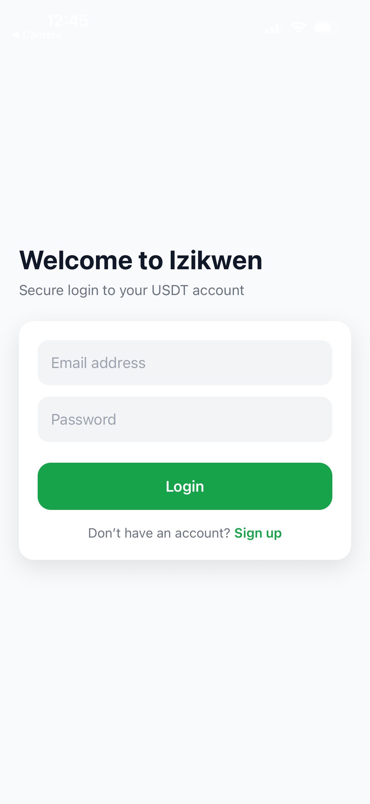

# Izikwen App 
A secure and modern mobile application built with **React Native + TypeScript** that allows users to authenticate, manage their profile, and perform secure transactions.

---

## 🚀 Features

- Secure Login & Registration
- JWT Authentication
- Two-Factor Authentication (2FA)
- User Dashboard
- Payment / Wallet System
- Profile Management
- Responsive Mobile UI
- API Integration with Backend (Spring Boot / Node / etc.)

---

## 🛠️ Tech Stack

**Frontend**
- React Native
- TypeScript
- Expo
- NativeWind / Tailwind (if you used it)

**Backend**
- Java Spring Boot *(or Node.js if applicable)*
- JWT Security
- REST APIs

**Database**
- PostgreSQL / MySQL / H2 / MongoDB *(choose yours)*

---

## 📸 Screenshots

### Login Screen


### Two-Factor Authentication


### Dashboard


### Payment / Wallet


### Profile


---

## 📂 Project Structure

IzikwenApp
├─ app
├─ assets
│ └─ images
├─ components
├─ context
├─ services
├─ styles
├─ package.json
└─ README.md


---

## ⚙️ Installation

### 1. Clone Repository
```bash
git clone https://github.com/yourusername/your-repo.git
cd your-repo
2. Install Dependencies
npm install
3. Start Project
npx expo start
🔐 Authentication Flow
User enters email & password

Backend validates credentials

JWT Access Token generated

Optional 2FA verification

Secure session established

💳 Payment / Wallet Flow
User adds funds or selects payment

Secure API request sent

Transaction validated

Balance updated

Confirmation returned

🌍 Future Improvements
Push Notifications

Biometric Login

Multi-language Support

Advanced Analytics

Dark Mode

👤 Author

Valraud Chery
Computer Science Student & Full-Stack Developer
Boston, MA

📄 License

This project is licensed under the MIT License.
